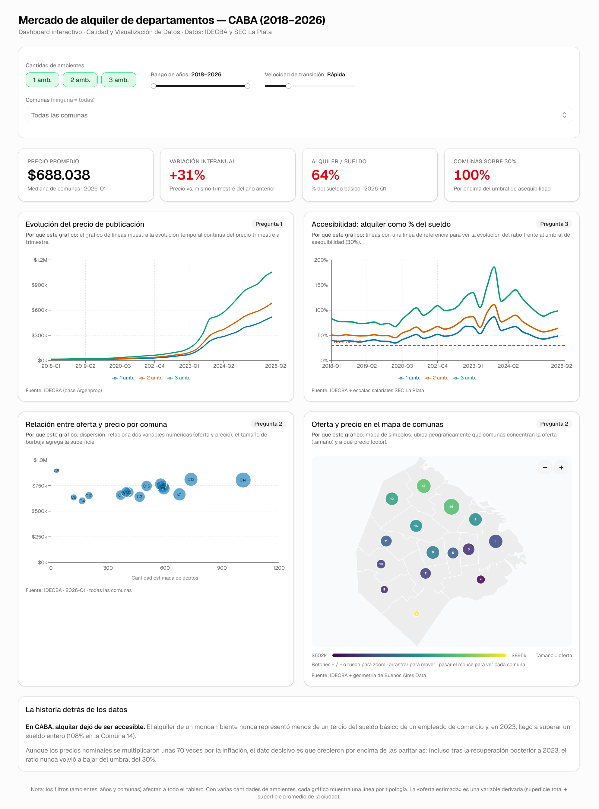

# Dashboard del mercado de alquiler en CABA (2018-2026)

Dashboard web interactivo del Trabajo Final Integrador de Calidad y Visualización de Datos. Muestra la evolución de precios, oferta y accesibilidad del alquiler de departamentos en CABA, y responde a las tres preguntas de análisis del trabajo mediante KPIs y gráficos dinámicos (filtrables por cantidad de ambientes, rango de años y comuna).

## Stack

React, TypeScript y Vite. Tailwind CSS con shadcn/ui para la interfaz, Recharts para los gráficos y d3-geo para el mapa de comunas.

## Instalación y ejecución

```bash
npm install      # solo la primera vez
npm run dev      # entorno de desarrollo en http://localhost:5173
npm run build    # versión de producción en dist/
```

## Contenido

**KPIs:** precio promedio actual, variación interanual, ratio alquiler/sueldo y porcentaje de comunas por encima del umbral del 30 %.

**Filtros:** cantidad de ambientes (1, 2 y 3), rango de años y selección de comunas. Afectan a todo el tablero en tiempo real.

**Gráficos** (cada uno con su justificación a la vista):

| Gráfico | Pregunta | Tipo y motivo |
|---|---|---|
| Evolución de precios | 1 | Líneas, para mostrar la evolución temporal continua |
| Accesibilidad alquiler/sueldo | 3 | Líneas con referencia en el 30 %, para comparar contra un umbral |
| Oferta vs. precio por comuna | 2 | Dispersión, para relacionar dos variables numéricas |
| Mapa de comunas | 2 | Mapa de símbolos, para la distribución geográfica (tamaño = oferta, color = precio) |

## Datos

El dashboard lee el dataset maestro desde `public/data` sin modificar el archivo original; la fecha se deriva en tiempo de ejecución a partir del campo `periodo_trim`. Las fuentes son IDECBA y el SEC La Plata para los datos, y Buenos Aires Data para la geometría de las comunas.

> La «oferta estimada» es una variable derivada (superficie total dividida por la superficie promedio de la ciudad). La Comuna 8 puede no aparecer en el mapa por falta de precio publicado en el período.




## Demo

https://dashboard-cvd-unsada.vercel.app/
